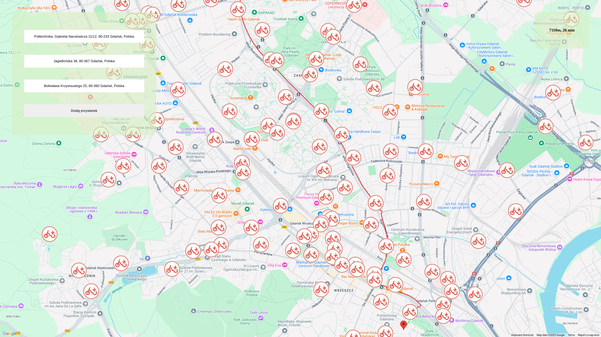
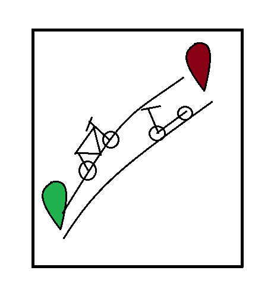

# Hackathon 2024 - GiTrip

## Smart-city

Projekt wykonany przez Gitcorp.

## Uruchamianie
``` flask --app main run --debug ```

## Instalacja przez obraz Docker
``` docker run -p 5000:5000 --restart=unless-stopped -d --name gitrip ghcr.io/gitmanik/gitrip:main ```
</br>

Paczka jest automatycznie aktualizowana za każdym commitem do głównego brancha.

## Instalacja w tradycyjny sposób (Windows)
```
python -m venv venv 
venv\bin\activate
pip3 install -r requirements.txt
```

## Używane biblioteki:
* Flask 3.0.0
* googlemaps 4.10.0

<p align="center">
  
</p>
